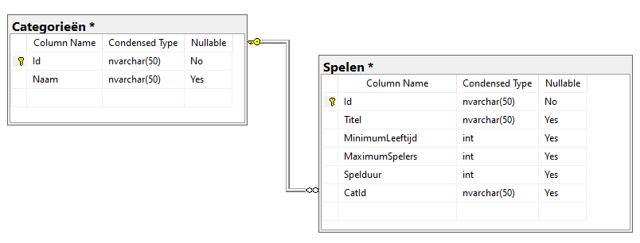

# DB Programmeren - DAPPER   
  
# Oefening geszelschapsspelen Versie 1   
  
## Voorbereiding    
  
Maak op je SQL Server zelf een nieuwe database aan met de naam **ScalaGezelschapsspelen**.    
Voeg aan deze database 2 tabellen toe :   
    
  
  
  * Tabel **Categorieën**   
    * Id, nvarchar(50), PK  
    * Naam, nvarchar(50)   
  * Tabel **Spelen**  
    * Id, nvarchar(50), PK   
    * Titel, nvarchar(50)  
    * MinimumLeeftijd, int  
    * MaximumSpelers, int  
    * Spelduur, int   
    * CatId, nvarchar(50) (FK met verwijzing naar Categorieën.Id)  

## Opdracht  

In het WPF project vind je al alle nodige controls om deze tabel te beheren.  
Voorzie een class library die de schakel vormt tussen jouw applicatie en jouw database.  
Gebruik Dapper/Dapper Contrib  
